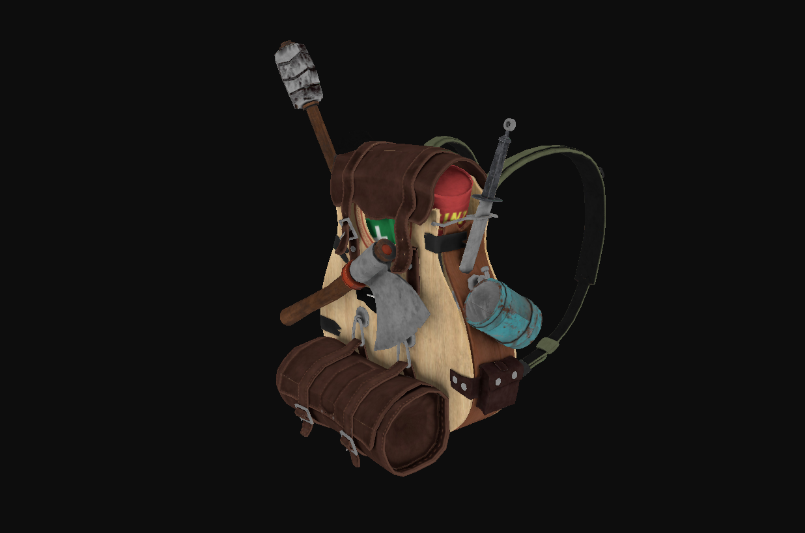

# Learn-OpenGL
This repo helps me keeping track on mister's [Joey de Vries](https://learnopengl.com/) OpenGL Book. <br>

Compile and run with ```g++ main.cpp -std=c++17 -lstdc++fs -lassimp -lGL -lglfw && ./a.out```

# What latest commit renders

